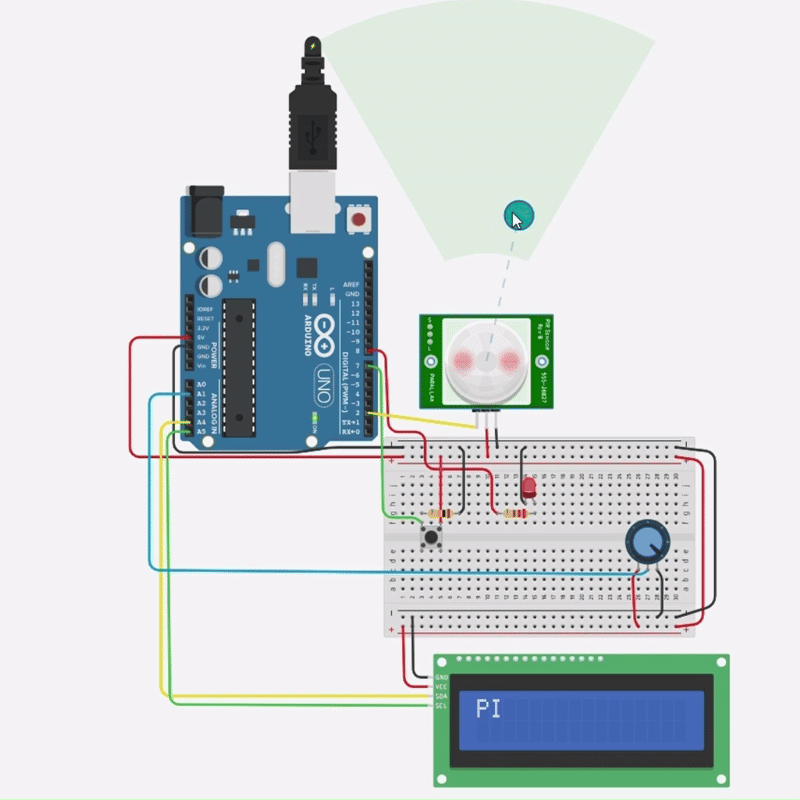

# Digital and Analog Sensor Project with Arduino

This project demonstrates the integration of **digital and analog sensors** using Arduino, designed and tested via **Tinkercad**. The system combines a **PIR motion sensor**, a **potentiometer**, a **button**, an **LED**, and an **I2C LCD** to provide interactive input and output functionality.

---

##  Components Used

- Arduino Uno
- PIR Sensor (Motion Detector) – *Digital input*
- Potentiometer – *Analog input (A1)*
- Push Button – *Digital input (D7)*
- LED – *Digital output (D8)*
- I2C LCD Screen – *Display output*
- Breadboard & Jumper Wires

---

##  Circuit Connections

| Component       | Arduino Pin |
|----------------|-------------|
| PIR Sensor     | D2          |
| Potentiometer  | A1          |
| Push Button    | D7          |
| LED            | D8          |
| I2C LCD        | SDA → A4    |
|                | SCL → A5    |

---

##  How It Works

1. When motion is detected by the **PIR sensor**, the **LED turns on**.
2. The **potentiometer** value is read and shown live on the **LCD screen**.
3. Pressing the **push button** toggles a state (on/off), and the state is also shown on the screen.

---

##  Demo

Below is a short GIF demo showing how the circuit works:

---

##  Notes

- The system is coded in Arduino IDE and tested successfully in Tinkercad.
- Make sure to use the correct **I2C address** for your LCD. Common ones are `0x20` or `0x3F`.

---

##  Status

✔️ Fully Working  
✔️ Tested on Tinkercad Simulation  
✔️ Ideal for learning digital vs analog sensor behavior

---

> Developed by Amjad